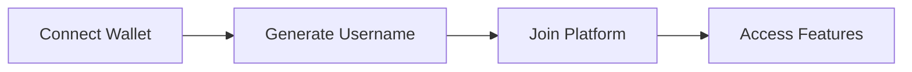
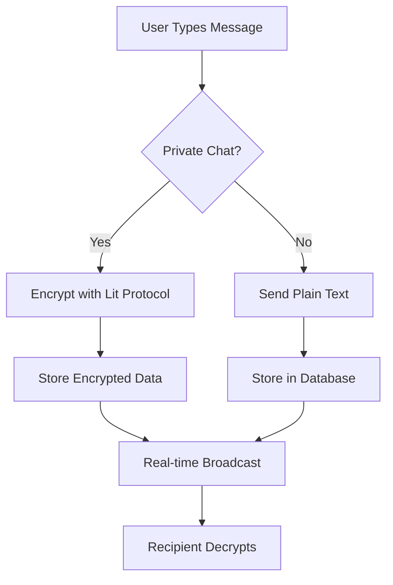
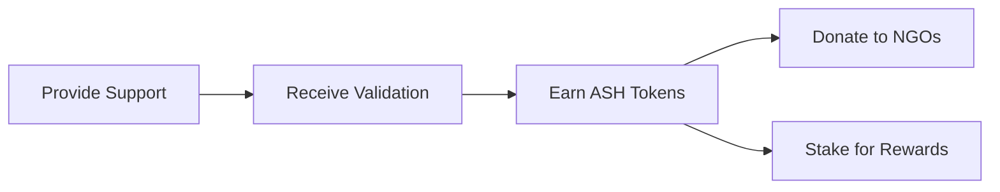
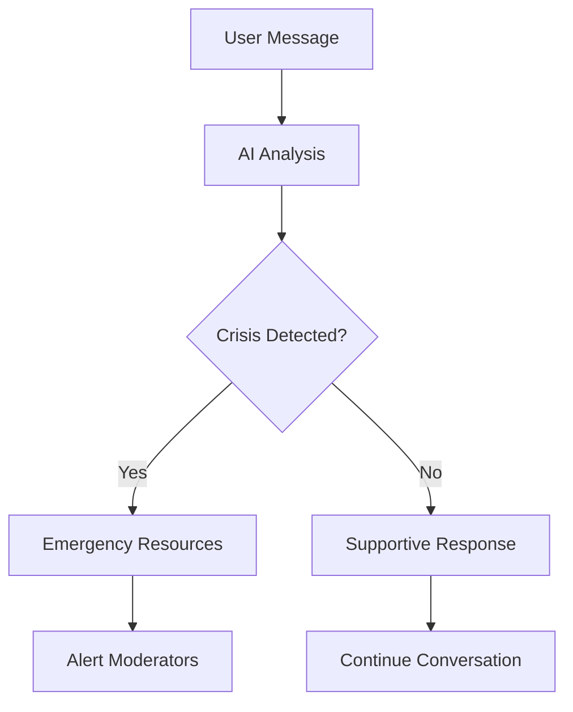

#  MindVault - Decentralized Mental Health Support Platform

<div align="center">


[](https://web3.foundation/)
[](https://ethereum.org/)
[](https://openai.com/)
[](https://litprotocol.com/)

**A revolutionary decentralized platform combining Web3 technology with AI-powered mental health support**


[ **Live Demo**](https://mindvault-engi.vercel.app/) 

</div>

---

##  Table of Contents

- [ Overview](#overview)
  - [ Problem Statement](#problem-statement)
  - [ Our Solution](#our-solution)
- [ Key Features](#key-features)
  - [ Privacy & Security](#privacy--security)
  - [ AI-Powered Support](#ai-powered-support)
  - [ Community Features](#community-features)
  - [ Tokenomics & Incentives](#tokenomics--incentives)
  - [ NGO Integration](#ngo-integration)
- [ Platform Screenshots](#platform-screenshots)
  - [ Home Page](#home-page)
  - [ Chat Interface](#chat-interface)
  - [ User Profile & Token Management](#user-profile--token-management)
  - [ AI Assistant](#ai-assistant)
- [ Architecture](#architecture)
  - [Frontend Stack](#frontend-stack)
  - [Backend Stack](#backend-stack)
  - [Blockchain Stack](#blockchain-stack)
  - [AI Integration](#ai-integration)
- [ How It Works](#how-it-works)
  - [1. User Onboarding](#1-user-onboarding)
  - [2. Messaging Flow](#2-messaging-flow)
  - [3. Token Economy](#3-token-economy)
  - [4. AI Integration](#4-ai-integration)
- [ Smart Contracts](#smart-contracts)
  - [ASH Token (ERC-20)](#ash-token-erc-20)
  - [Foundation Contracts](#foundation-contracts)
- [ Team](#team)
- [ Hackathon Submission](#hackathon-submission)
  - [Theme: Mental Health & Web3 Innovation](#theme-mental-health--web3-innovation)
  - [Technologies Used](#technologies-used)
  - [Key Innovations](#key-innovations)
  - [Impact Potential](#impact-potential)
- [ Future Roadmap](#future-roadmap)
  - [Phase 1: Core Platform (Current)](#phase-1-core-platform-current)
  - [Phase 2: Enhanced Features (Q2 2025)](#phase-2-enhanced-features-q2-2025)
  - [Phase 3: Platform Expansion (Q3 2025)](#phase-3-platform-expansion-q3-2025)
  - [Phase 4: Ecosystem Growth (Q4 2025)](#phase-4-ecosystem-growth-q4-2025)
- [ Acknowledgments](#acknowledgments)

---

##  Overview

MindVault is a groundbreaking mental health platform that leverages Web3 technology to create safe, anonymous, and decentralized spaces for mental wellness support. By combining blockchain technology, AI assistance, and community-driven care, we're revolutionizing how people access and provide mental health support.

###  Problem Statement

- **Privacy Concerns**: Traditional mental health platforms lack true anonymity
- **Accessibility**: Limited access to affordable mental health resources
- **Community Support**: Lack of peer-to-peer support mechanisms
- **Trust Issues**: Centralized platforms controlling sensitive data
- **Incentivization**: No rewards for community members who provide support

###  Our Solution

MindVault addresses these challenges through:
- **Blockchain-based anonymity** using wallet-based authentication
- **End-to-end encryption** with Lit Protocol for secure messaging
- **AI-powered mental health assistant** for 24/7 support
- **Token-based incentivization** rewarding community support
- **Decentralized donations** to mental health NGOs

---

##  Key Features

###  **Privacy & Security**
- **Wallet-based Authentication**: Connect with MetaMask for anonymous access
- **Lit Protocol Encryption**: End-to-end encrypted messaging for private conversations
- **Decentralized Data**: No centralized storage of sensitive information
- **Anonymous Profiles**: Identify by wallet address, not personal information

###  **AI-Powered Support**
- **24/7 AI Assistant**: Immediate mental health guidance and crisis support
- **Personalized Responses**: Context-aware conversations tailored to individual needs
- **Resource Recommendations**: Curated mental health resources and coping strategies

###  **Community Features**
- **Global Support Groups**: Join anonymous public discussions
- **Private Messaging**: One-on-one encrypted conversations
- **Peer Validation**: Community-driven message verification system
- **Reply Threads**: Contextual conversation management

###  **Tokenomics & Incentives**
- **ASH Token**: Native ERC-20 token for platform interactions
- **Reward System**: Earn tokens for providing valuable community support
- **Donation Platform**: Direct token donations to verified mental health NGOs
- **Staking Rewards**: Additional incentives for active community members

###  **NGO Integration**
- **Verified Partners**: Integration with legitimate mental health organizations
- **Transparent Donations**: Blockchain-tracked charitable contributions
- **Impact Tracking**: Real-time donation impact measurements
- **Foundation Support**: Support for Manas, Minds, and Mitram Foundations

---

## Platform Screenshots

<div align="center">

###  **Home Page**


*Landing page showcasing MindVault's mission and key features*

###  **Chat Interface**


*Real-time messaging with encrypted conversations and AI assistance*

###  **User Profile & Token Management**


*User dashboard with ASH token balance and donation features and community rankings with ngo donations*


###  **AI Assistant**

*24/7 AI-powered mental health support and guidance*

</div>

---

##  Architecture

### **Frontend Stack**
```
React 19 + TypeScript
├──  Tailwind CSS - Styling & UI Components
├──  React Router - Navigation & Routing
├──  Wagmi + Viem - Web3 Integration
├──  Socket.IO - Real-time Communication
├──  Sonner - Toast Notifications
├──  TanStack Query - Data Management
└──  Framer Motion - Animations
```

### **Backend Stack**
```
Node.js + Express + TypeScript
├── Prisma ORM - Database Management
├── PostgreSQL - Primary Database
├── Socket.IO - WebSocket Server
├── Lit Protocol - Encryption Services
├── Ethers.js - Blockchain Interaction
└── Token Minting Service - ASH Token Management
```

### **Blockchain Stack**
```
Ethereum Sepolia Testnet
├── ASH Token (ERC-20) - Native Platform Token
├── Foundation Contracts - NGO Donation Recipients
├── Foundry - Smart Contract Development
└── Deployment Scripts - Automated Contract Deployment
```

### **AI Integration**
```
Gemini GPT Integration
├── Mental Health Assistant - Specialized AI Responses
├── Resource Curation - Personalized Recommendations
└── Conversation Context - Stateful Interactions
```

---

##  How It Works

### 1. **User Onboarding**


### 2. **Messaging Flow**


### 3. **Token Economy**


### 4. **AI Integration**


---

##  Smart Contracts

### ASH Token (ERC-20)
- **Contract Address**: `0x652Cdd1D2Aa3c7a2804a18816B90eD44Ec6AdC22`
- **Total Supply**: 1,000,000 ASH
- **Decimals**: 18
- **Features**: Mintable by owner, standard ERC-20 functionality

### Foundation Contracts
- **Manas Foundation**: `0x846E9C974Db0bF19caf739768Aa6E4CcD8378adD`
- **Minds Foundation**: `0xFe5036504D3e3620346e19C643Be813477E34B68`
- **Mitram Foundation**: `0x331a975530127C6a02f01D5F9eC8Fa3d31fc2352`

Each foundation contract supports:
- Token donations
- Balance tracking
- Owner withdrawals

---


##  Team

<table>
  <tr>
    <td align="center">
      
      <br />
      <sub><b>Ashlesh Prabhu</b></sub>
      <br />
      <a href="https://www.linkedin.com/in/ashlesh-prabhu-bb457b312/">💼 LinkedIn</a>
    </td>
    <td align="center">
      
      <br />
      <sub><b>Vidith</b></sub>
      <br />
      <a href="https://www.linkedin.com/in/vidith-venkatesha-murthy?utm_source=share&utm_campaign=share_via&utm_content=profile&utm_medium=android_app">💼 LinkedIn</a>
    </td>
    <td align="center">
      
      <br />
      <sub><b>Vamshikrishna</b></sub>
      <br />
      <a href="https://www.linkedin.com/in/vamshikrishna-v-bidari-154080329?utm_source=share&utm_campaign=share_via&utm_content=profile&utm_medium=android_app">💼 LinkedIn</a>
    </td>
  </tr>
</table>

---

##  Hackathon Submission

### **Theme**: Mental Health & Web3 Innovation
### **Technologies Used**:
-  React 19 with TypeScript
-  Web3 Integration (Wagmi, Viem)
-  Lit Protocol for Encryption
-  Gemini Integration
-  Ethereum Smart Contracts
-  PostgreSQL with Prisma ORM
-  Tailwind CSS for UI

### **Key Innovations**:
1. **Privacy-First Approach**: True anonymity through blockchain authentication
2. **Incentivized Community**: Token rewards for peer support
3. **AI-Human Hybrid Support**: Combining AI assistance with human empathy
4. **Transparent Donations**: Blockchain-tracked charitable giving
5. **End-to-End Encryption**: Secure private conversations

### **Impact Potential**:
- **Accessibility**: Lower barriers to mental health support
- **Privacy**: Enhanced user privacy and data security
- **Community**: Stronger peer support networks
- **Innovation**: Advancing Web3 adoption in healthcare
- **Sustainability**: Self-sustaining token economy

---

##  Future Roadmap

### Phase 1: Core Platform (Current)
-  Basic messaging and AI support
-  Token integration and donations
-  End-to-end encryption

### Phase 2: Enhanced Features (Q2 2025)
-  Advanced AI therapy sessions
-  Mood tracking and analytics
-  Group therapy rooms
-  Professional therapist integration

### Phase 3: Platform Expansion (Q3 2025)
-  Mobile application
-  Multi-language support
-  Partnership with healthcare providers
-  Advanced analytics dashboard

### Phase 4: Ecosystem Growth (Q4 2025)
-  Marketplace for mental health resources
-  Educational content platform
-  Cross-chain compatibility
-  DAO governance implementation


##  Acknowledgments

- **Lit Protocol** for decentralized encryption solutions
- **OpenAI** for AI integration capabilities
- **Ethereum Foundation** for blockchain infrastructure
- **Mental Health Organizations** for guidance and partnership
- **Open Source Community** for invaluable tools and libraries

---

<div align="center">

**Built with ❤️ for mental health awareness and Web3 innovation**

[⭐ Star this project](https://github.com/AshleshPrabhu/Mind-Vault) if you found it helpful!

</div>